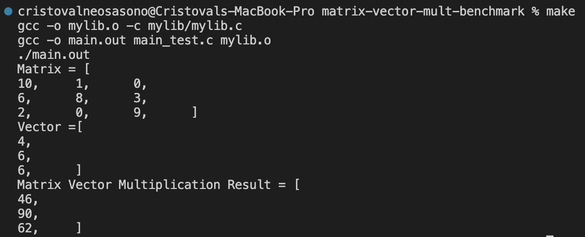
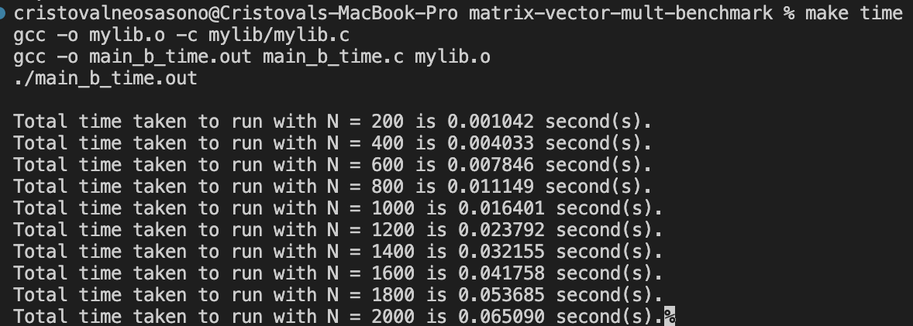
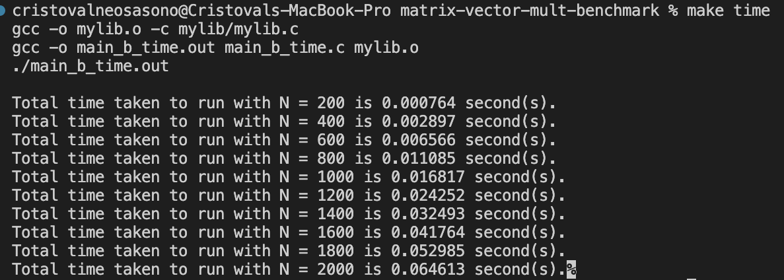
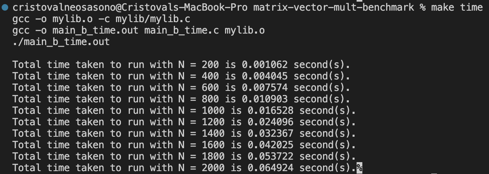
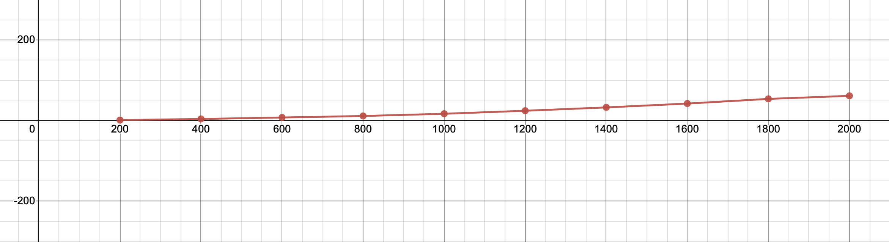

Made by: Cristoval Neo Sasono_2602158235_L1BC

# Matrix-Vector-Mult-Benchmark

This is a program written in C language, made to randomly generate an NxN Matrix with an Nx1 Vector, before multiplying them together.

# Running The Program

The result shown bellow shows that the matrix-vector function is working properly. If in doubt, use any matrix multiplication calculator or calculate it manually.

Open your terminal (Can either be directly or from an IDE) and make sure the correct directory containing all the necessary files is open('matrix-vector-mult-benchmark').

Write the following lines in your terminal:
- make          : To check the matrix-vector multiplication function
- make time     : To check the time complexity of the matrix-vector multiplication function.
- make space    : To check the space complexity of the matrix-vector multiplication function.
- make clear    : To clear all object and out files.
 
 # Self-Test: Checking The Function

# Self-Test: Analyzing The Time Complexity

The result shown bellow shows the time complexity of the function with different matrix sizes (N):

Test 1:

Test 2:

Test 3:

    Average result:
    N = 200 -> 0.000956 s -> 0.956 ms
    N = 400 -> 0.003658 s -> 3.658 ms
    N = 600 -> 0.007328 s -> 7.328 ms
    N = 800 -> 0.011045 s -> 11.045 ms
    N = 1000 -> 0.016582 s -> 16.582 ms
    N = 1200 -> 0.024046 s -> 24.046 ms
    N = 1400 -> 0.032338 s -> 32.338 ms
    N = 1600 -> 0.041849 s -> 41.849 ms
    N = 1800 -> 0.053464 s -> 53.464 ms
    N = 2000 -> 0.060999 s -> 60.999 ms

Graph results of Time Complexity:

# Self-Test: Analyzing The Space Complexity

The result shown bellow shows the space complexity of the function with different matrix sizes (N):

N = 200:

N = 400:

N = 600:

N = 800:

N = 1000:

N = 1200:

N = 1400:

N = 1600:

N = 1800:

N = 2000:

Graph results of Space Complexity:
